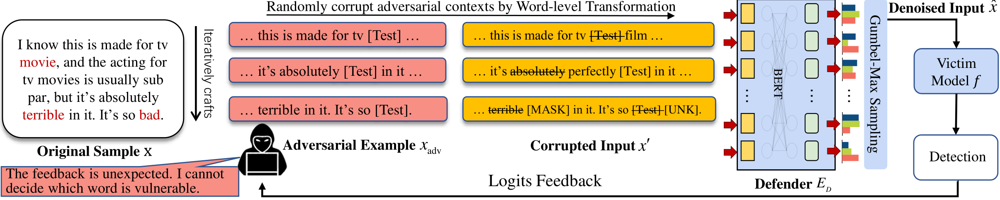

# RMLM

Code for [paper](https://aclanthology.org/2023.acl-long.155.pdf) "RMLM: A Flexible Defense Framework for Proactively Mitigating Word-level Adversarial Attacks" accepted by ACL 2023. This repo contains training, inference and attack-defense evaluation.

<p align="center">
     <br>
</p>

## Requirements

**Environment**

The basic required packages are as follows. It's highly suggested to install the specific missed packages only when you find running codes failed.

1. Python 3.8
2. Pytorch 1.9.0 + cuda 11.1
3. Tensorflow 2.7.0
4. huggingface/transformers 4.13.0 (you may also need pre-trained BERT-base-uncased weights)
5. nltk 3.6.5
6. gpustat

**Pre-processed Data**

Please decompress ``dataset.tar.gz`` and ``glove.tar.gz`` in the [release page](https://github.com/Raibows/RMLM/releases) to ``dataset/`` and ``glove/``, respectively. 

## Training

### Fine-tuning BERTD

This fine-tuning stage is correlated to Sec. 3.4.1 of the paper. BERTD is short for ``BERT defender``. 

```bash
python mlm.py --dataset imdb --epoch 100 --batch 32 --device 0 --rmlm yes
```

All experimental results (e.g., checkpoints) will be saved to ``checkpoint/``.

Fill ``config.py/config_victim_imdb/load_path/lm_bert_rmlm`` with the path of trained checkpoint directory.

### Victim Model

For example, we train a BERT-base-uncased as the victim model.

```bash
python train.py --device 0 --epoch 10 --batch 64 --warmup 600 --optim adamw \
--save_type victims --dataset imdb --model bert --using_bert_vocab yes \
--eval_path valid --metric_name valid_acc
```

Fill ``config.py/config_victim_imdb/load_path/bert`` with the path of trained victim model ``xxx.pt``.

### Joint Training

The details of this stage are in Sec. 3.4.2.

```bash
python train.py --device 0,1,2,3 --epoch 20 --batch 16 --warmup 600 --optim adamw \
--save_type defense --dataset imdb --model bert --using_bert_vocab yes \
--eval_path valid --metric_name valid_acc --using_rmlm yes \
--rmlm_mode gumbel --rmlm_update last --rmlm_maskop rmlm \
--rmlm_mask_rate 0.25 --rmlm_max_syn 32
```

Fill ``config.py/config_rmlm_best_loads/imdb/bert`` with the path of trained checkpoint ``xxx.pt``.

### Prior Threshold

Please refer to Sec. 3.5. We need to calculate this threshold before the evaluation.

```python
python entropy.py --dataset imdb --victim bert --device 0
```

Then, fill ``config.py/config_rmlm_best_loads/imdb/bert/threshold`` with the calculated value.

## Attack Evaluation

Note that you may need to install some missing packages like ``NLTK`` for [thunlp/OpenAttack](https://github.com/thunlp/OpenAttack) first. If you failed to download some metadata when running the codes, please manually download ``nltk.wordnet.tar.gz`` in the release page, and decompress it to ``data/``.

Start the attack-defense evaluation, ``bert`` victim model with our method ``rmlm`` defends against ``pwws`` attacker on the ``imdb`` dataset. 

```bash
python attack.py --dataset imdb --victim bert --attack pwws --device 0 \
--using_bert_vocab yes --eval_path attack --using_rmlm yes 
```

The evaluation results including all reported metrics will be saved in ``checkpoint/imdb/attack/bert_rmlm.pwws.$time.json``.

## Citation

Please cite our paper if you find the codes useful:

```
@inproceedings{wang-etal-2023-rmlm,
    title = "{RMLM}: A Flexible Defense Framework for Proactively Mitigating Word-level Adversarial Attacks",
    author = "Wang, Zhaoyang  and
      Liu, Zhiyue  and
      Zheng, Xiaopeng  and
      Su, Qinliang  and
      Wang, Jiahai",
    editor = "Rogers, Anna  and
      Boyd-Graber, Jordan  and
      Okazaki, Naoaki",
    booktitle = "Proceedings of the 61st Annual Meeting of the Association for Computational Linguistics (Volume 1: Long Papers)",
    month = jul,
    year = "2023",
    address = "Toronto, Canada",
    publisher = "Association for Computational Linguistics",
    url = "https://aclanthology.org/2023.acl-long.155",
    doi = "10.18653/v1/2023.acl-long.155",
    pages = "2757--2774",
}
```


 
